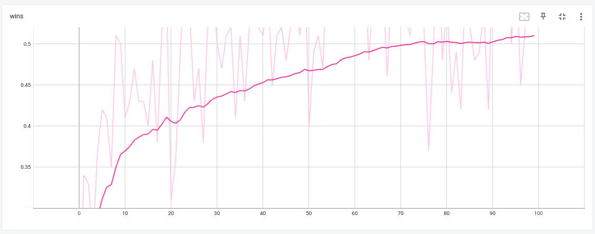
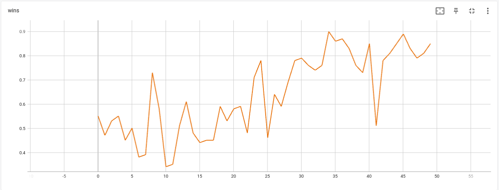

# PROBS - Predict Result of Beam Search

This repository is an implementation of PROBS algorithm:

Paper: https://arxiv.org/abs/2404.16072 - Playing Board Games with the Predict Results of Beam Search Algorithm

## Introduction

* This is an algorithm for solving board games: two player, deterministic games with full information. It is similar to AlphaZero, but uses much simpler beam search instead of MCTS. Goal of this work is to show that such simplification also work well and can be trained to get winning agent. I don't have enough computational resources to make a fair comparison with AlphaZero, so if you like to contribute - please email me (email is in paper).

* Two separated networks:

    * Value model: given state `s` predict terminal reward `[-1 ... 1]` if both players play following policy derived from `Q` with added exploration noise

    * Q-Value model: given state `s` for each action `a` predict result of beam search starting from `(s,a)`

* Algorithm is an iterative cycle of the following steps:

    * Execute a predefined number of self-play games. Select moves based on `softmax(Q(s, a))` and Dirichlet noise to boost exploration. Save all games in experience replay

    * Train `V` on each state to predict outcome of the episode for the current player

    * On each observed state start a beam search to generate a limited sub-tree of the game:

        * Root node in beam search game sub-tree is `s0`

        * Always expand `s0` node. Other nodes are expanded in order of their priority

        * When node `s_i` is expanded, its child nodes priorities are `Q(s_i, a_j)`

        * Parameter `M` to control depth limit of the game sub-tree

        * Parameter `E` to control number of expanded nodes

        * Value of a leaf state is `V(s_leaf)`

        * Value of a terminal state is its reward coming from emulator

        * Value of expanded node `s_i` is `max(-child_state_value for every child node)` - every child node value is the value for the next player, so for the player at `s_i` its value is negative. And in order to play optimally player at `s_i` needs to maximize its value.

        * Values of child nodes of root `s0` will be used as a target for `Q(s, a)`

    * Train `Q` using outcome of the beam search as a target for each episode from the experience replay

    * Clear experience replay


## Installation

We used conda environment on Ubuntu 20.04.4 LTS.

1). Install conda https://conda.io/projects/conda/en/latest/user-guide/install/index.html

2). Create environment: `conda create --name probs_env -c conda-forge -c pytorch --file requirements.txt`

3). Activate environment: `conda activate probs_env`

## Usage constants

`ENV_NAME` is one of:

* connect_four - https://en.wikipedia.org/wiki/Connect_Four

* reversi - https://en.wikipedia.org/wiki/Reversi

`AGENT_NAME` is one of:

* random

* one_step_lookahead - analyzes all potential moves to either execute a winning move, if available,
avoid immediate losing moves, or otherwise select randomly from the remaining moves

* two_step_lookahead - same, but evaluates the game tree up to two moves ahead

* three_step_lookahead - sum, but three moves ahead

* encoded string of model names and checkpoint:

    * `V=ValueModel1,SL=SelfLearningModel1` - creates new value model of type `ValueModel1` and Q-value model of type `SelfLearningModel1`

    * `V=ValueModel1,SL=SelfLearningModel1,CKPT=/home/user/checkpoint.ckpt` - load value model of type `ValueModel1` and Q-value model of type `SelfLearningModel1` from the checkpoint file `/home/user/checkpoint.ckpt`. Also loads optimizers state from the checkpoint

## Usage

### Play human vs agent

Play game interactively against a specified agent:

`python go_probs.py --cmd play_vs_human --env <ENV_NAME> --enemy <AGENT_NAME>`

Examples:

1). Play connect four against random agent:

`python go_probs.py --cmd play_vs_human --env connect_four --enemy random`

2). Play connect four against one step lookahead agent:

`python go_probs.py --cmd play_vs_human --env connect_four --enemy one_step_lookahead`

3). Play connect four against three step lookahead agent:

`python go_probs.py --cmd play_vs_human --env connect_four --enemy three_step_lookahead`

4). Play connect four against trained AI agent which uses value model of type `ValueModel1`, Q-value model of type `SelfLearningModel1`, and loaded from checkpoint file `/home/user/checkpoint.ckpt`

`python go_probs.py --cmd play_vs_human --env connect_four --enemy V=ValueModel1,SL=SelfLearningModel1,CKPT=/home/user/checkpoint.ckpt`

### Play agent vs agent

Make two AI agents play against each other.

`python go_probs.py --cmd battle --env <ENV_NAME> --model <AGENT_NAME> --enemy <AGENT_NAME> --evaluate_n_games <NUM_GAMES> [--randomize_first_turn]`

Optional parameters:

* `--evaluate_n_games <NUM_GAMES>` - number of games to play (default 1000)

* `--n_max_episode_steps <NUM_STEPS>` - max number of steps in each game (default 200)

* `--randomize_first_turn` - if present, first turn will be selected randomly (useful if agents are deterministic and one of the agent always win/lose on its first turn)

Examples:

1). Make a battle between random player vs random player, 1000 games of connect four:

`python go_probs.py --cmd battle --env connect_four --model random --enemy random --evaluate_n_games 1000`

Output: RandomAgent wins 0.50900, losses 0.49100

2). Make a battle between one step lookahead player vs random player, 1000 games of connect four:

`python go_probs.py --cmd battle --env connect_four --model one_step_lookahead --enemy random --evaluate_n_games 1000`

Output: OneStepLookaheadAgent wins 0.75100, losses 0.24900

3). Make a battle between two step lookahead player vs one step lookahead player, 1000 games of connect four:

`python go_probs.py --cmd battle --env connect_four --model two_step_lookahead --enemy one_step_lookahead --evaluate_n_games 1000`

Output: TwoStepLookaheadAgent wins 0.91100, losses 0.08900

4). Make a battle between three step lookahead player vs two step lookahead player, 1000 games of connect four:

`python go_probs.py --cmd battle --env connect_four --model three_step_lookahead --enemy two_step_lookahead --evaluate_n_games 1000`

Output: ThreeStepLookaheadAgent wins 0.66300, losses 0.33700

5). Make a battle between trained model vs two step lookahead player, 1000 games of reversi:

`python go_probs.py --cmd battle --env reversi --model V=ValueModel1,SL=SelfLearningModel1,CKPT=checkpoints_reversi/checkpoint.ckpt --enemy two_step_lookahead --evaluate_n_games 1000`

Output: SelfLearningModel1 wins 0.89600, losses 0.10400

### Train AI model

Start training:

```
python go_probs.py --cmd train --env <ENV_NAME> \
--model <MODEL_NAME_ENCODED> \
--enemy <AGENT_NAME> \
--log tf \
--checkpoints_dir=<FILEPATH> \
--self_play_threads <NUM_THREADS> \
--n_high_level_iterations <NUM_ITERS> \
--n_games_per_iteration <NUM_GAMES> \
--n_max_episode_steps <MAX_STEPS> \
--num_q_s_a_calls <NUM_EXPAND_CALLS> \
--max_depth <MAX_DEPTH>
```

Parameters:

* `--env <ENV_NAME>` environment name

* `--model <MODEL_NAME>` encoded string of model names and checkpoint

* `--enemy <AGENT_NAME>` name of the agent to evaluate. Evaluation happens at the end of each iteration

* `--log tf` optional, add if you want to write training curves to tensorboard

* `--checkpoints_dir <PATH>` optional, filepath to save checkpoints at each iteration

* `--self_play_threads <NUM_THREADS>` number of threads to use for self-playing

* `--n_high_level_iterations <NUM_ITERS>` number of high level iterations

* `--n_games_per_iteration <NUM_GAMES>` games per iteration

* `--n_max_episode_steps <MAX_STEPS>` max steps for each game

* `--num_q_s_a_calls <NUM_EXPAND_CALLS>` number of expand calls during beam search

* `--max_depth <MAX_DEPTH>` max depth of beam search game tree

Examples:

1). Train Connect Four agent from scratch:

```
time python go_probs.py --cmd train --env connect_four \
--model V=ValueModel2,SL=SelfLearningModel2 \
--enemy two_step_lookahead \
--log tf \
--checkpoints_dir=checkpoints_connect_four \
--self_play_threads 7 \
--n_high_level_iterations 100 \
--n_games_per_iteration 1000 \
--n_max_episode_steps 100 \
--num_q_s_a_calls 100 \
--max_depth 100
```

Output: Trained agent total wins 60, losses 40, draws 0. Detailed result: [29, 31, 19, 21, 0]



To continue training replace `--model` with `V=ValueModel2,SL=SelfLearningModel2,CKPT=checkpoints_connect_four/checkpoint.ckpt`

2). Train Reversi agent from scratch:

```
time python go_probs.py --cmd train --env reversi \
--model V=ValueModel1,SL=SelfLearningModel1 \
--enemy two_step_lookahead \
--log tf \
--checkpoints_dir=checkpoints_reversi \
--self_play_threads 7 \
--n_high_level_iterations 50 \
--n_games_per_iteration 200 \
--n_max_episode_steps 100 \
--num_q_s_a_calls 500 \
--max_depth 5
```



3). Continue Reversi training from checkpoint file:

```
time python go_probs.py --cmd train --env reversi \
--model V=ValueModel1,SL=SelfLearningModel1,CKPT=checkpoints_reversi/checkpoint.ckpt \
--enemy two_step_lookahead \
--log tf \
--checkpoints_dir=checkpoints_reversi \
--self_play_threads 7 \
--n_high_level_iterations 50 \
--n_games_per_iteration 200 \
--n_max_episode_steps 100 \
--num_q_s_a_calls 500 \
--max_depth 5
```