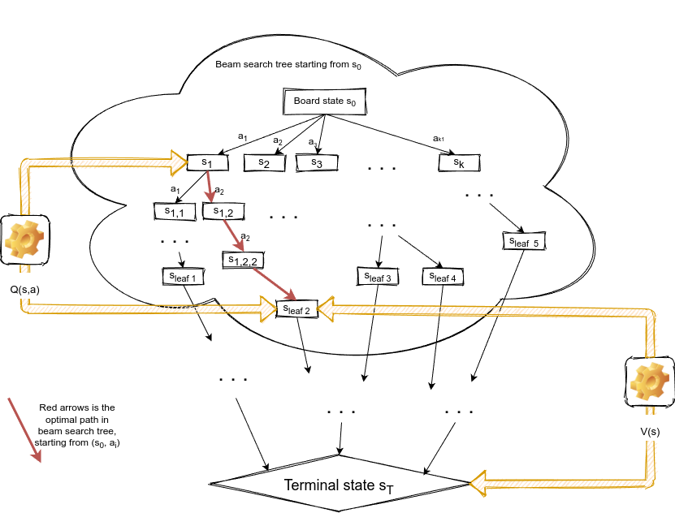
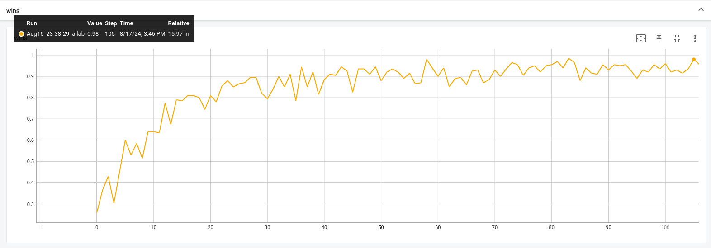

# PROBS - Predict Result of Beam Search

This repository is an implementation of PROBS algorithm:

* Play live: https://www.levinson.ai/games/chess6x6

* Blog post (featuring story of chess6x6 agent) - https://medium.com/@omikad/train-ai-to-play-chess-6x6-using-probs-algorithm-539e39a9dea6

* Paper: https://arxiv.org/abs/2404.16072 - Playing Board Games with the Predict Results of Beam Search Algorithm

# Introduction

* This is an algorithm for solving board games: two player, deterministic games with full information. It is similar to AlphaZero, but uses much simpler beam search instead of MCTS. Goal of this work is to show that such simplification also work well and can be trained to get winning agent. I don't have enough computational resources to make a fair comparison with AlphaZero, so if you like to contribute - please email me (email is in paper).

* Two separated networks:

    * Value model: given state `s` predict terminal reward `[-1 ... 1]` if both players play following policy derived from `Q` with added exploration noise

    * Q-Value model: given state `s` for each action `a` predict result of beam search starting from `(s,a)`

* Algorithm is an iterative cycle of the following steps:

    * Execute a predefined number of self-play games. Select moves based on `softmax(Q(s, a))` and Dirichlet noise to boost exploration. Save all games in experience replay

    * Train `V` on each state to predict outcome of the episode for the current player

    * On each observed state start a beam search to generate a limited sub-tree of the game:

        * Root node in beam search game sub-tree is `s0`

        * Always expand `s0` node. Other nodes are expanded in order of their priority

        * When node `s_i` is expanded, its child nodes priorities are `Q(s_i, a_j)`

        * Parameter `M` to control depth limit of the game sub-tree

        * Parameter `E` to control number of expanded nodes

        * Value of a leaf state is `V(s_leaf)`

        * Value of a terminal state is its reward coming from emulator

        * Value of expanded node `s_i` is `max(-child_state_value for every child node)` - every child node value is the value for the next player, so for the player at `s_i` its value is negative. And in order to play optimally player at `s_i` needs to maximize its value.

        * Values of child nodes of root `s0` will be used as a target for `Q(s, a)`

    * Train `Q` using outcome of the beam search as a target for each episode from the experience replay

    * Clear experience replay



# Installation

We used conda environment on Ubuntu 20.04.4 LTS.

1). Install conda https://conda.io/projects/conda/en/latest/user-guide/install/index.html

2). Create environment: `conda create --name probs_env -c conda-forge -c pytorch --file requirements.txt`

3). Activate environment: `conda activate probs_env`

# Usage

## Usage agent

Agent string defines an agent who will be trained or played with:

* random

* one_step_lookahead - analyzes all potential moves to either execute a winning move, if available,
avoid immediate losing moves, or otherwise select randomly from the remaining moves

* two_step_lookahead - same, but evaluates the game tree up to two moves ahead

* three_step_lookahead - sum, but three moves ahead

* encoded string of model names and checkpoint:

    * `V=ValueModel1,SL=SelfLearningModel1` - creates new value model of type `ValueModel1` and Q-value model of type `SelfLearningModel1`

    * `V=ValueModel1,SL=SelfLearningModel1,CKPT=/home/user/checkpoint.ckpt` - load value model of type `ValueModel1` and Q-value model of type `SelfLearningModel1` from the checkpoint file `/home/user/checkpoint.ckpt`. Also loads optimizers state from the checkpoint

## Train Chess6x6

1). Create checkpoints directory: `mkdir ~/checkpoints_chess6x6/`

2). Test training loop once:

```
time python -u go_probs.py \
--env mychess6x6 \
--cmd train \
--device gpu \
--sub_processes_cnt 2 \
--self_play_threads 1 \
--n_high_level_iterations 1 \
--v_train_episodes 10 \
--q_train_episodes 10 \
--q_dataset_episodes_sub_iter 10 \
--dataset_drop_ratio 0.1 \
--model V=ValueModel66_v11,SL=SelfLearningModel66_v11 \
--checkpoints_dir=. \
--value_lr 0.0003 \
--self_learning_lr 0.0003 \
--value_batch_size 16 \
--self_learning_batch_size 16 \
--n_max_episode_steps 100 \
--num_q_s_a_calls 10 \
--max_depth 100 \
--get_q_dataset_batch_size 300 \
--alphazero_move_num_sampling_moves 20 \
--enemy two_step_lookahead \
--evaluate_n_games 10
```

3). Start training:

```
python -u go_probs.py \
--env mychess6x6 \
--cmd train \
--log tf \
--device gpu \
--sub_processes_cnt 10 \
--self_play_threads 1 \
--n_high_level_iterations 10000000 \
--v_train_episodes 6000 \
--q_train_episodes 3000 \
--q_dataset_episodes_sub_iter 3000 \
--dataset_drop_ratio 0.75 \
--model V=ValueModel66_v11,SL=SelfLearningModel66_v11 \
--checkpoints_dir=~/checkpoints_chess6x6/ \
--value_lr 0.0003 \
--self_learning_lr 0.0003 \
--value_batch_size 256 \
--self_learning_batch_size 256 \
--n_max_episode_steps 200 \
--num_q_s_a_calls 50 \
--max_depth 100 \
--get_q_dataset_batch_size 300 \
--alphazero_move_num_sampling_moves 20 \
--enemy two_step_lookahead \
--evaluate_n_games 100
```



## Train parameters

* `--env mychess6x6` - environment name

* `--cmd train` - command is to train model

* `--log tf` - log to tensorboard

* `--device gpu` - use GPU

* `--sub_processes_cnt 10` - split workload to 10 subprocesses

* `--self_play_threads 1` - split workload to 1 thread

* `--n_high_level_iterations 10000000` - large number of iterations to make training run lasting forever until you stop it

* `--v_train_episodes 6000` - number of self-play games to train V model

* `--q_train_episodes 3000` - number of self-play games to train Q model (main computational complexity lies here)

* `--q_dataset_episodes_sub_iter 3000` - number of self-play games to train Q model in each sub-iteration

* `--dataset_drop_ratio 0.75` - in order to prevent overfitting, drop this number of rows when training

* `--model V=ValueModel66_v11,SL=SelfLearningModel66_v11` - model to train, add `CKPT=filename` to continue training from existing checkpoint

* `--checkpoints_dir=~/checkpoints_chess6x6/` - where to save checkpoints

* `--value_lr 0.0003` - V model learning rate

* `--self_learning_lr 0.0003` - Q model learning rate

* `--value_batch_size 256` - V model batch size

* `--self_learning_batch_size 256` - Q model batch size

* `--n_max_episode_steps 200` - max number of turns in a game

* `--num_q_s_a_calls 50` - number of Q model calls in beam search

* `--max_depth 100` - max sub-game tree depth in beam search

* `--get_q_dataset_batch_size 300` - to optimize beam search, use this number of beam search in parallel

* `--alphazero_move_num_sampling_moves 20` - number of moves to sample actions, remaning moves will be selected greedily

* `--enemy two_step_lookahead` - at the end of each iteration play against this agent to evaluate trained model

* `--evaluate_n_games 100` - play this number of games to evaluate trained model


## Play human vs agent

Play game interactively against a specified agent:

`python go_probs.py --cmd play_vs_human --env <ENV_NAME> --model <AGENT_NAME>`

Examples:

1). Play connect four against random agent:

`python go_probs.py --cmd play_vs_human --env connect_four --model random`

2). Play connect four against one step lookahead agent:

`python go_probs.py --cmd play_vs_human --env connect_four --model one_step_lookahead`

3). Play connect four against three step lookahead agent:

`python go_probs.py --cmd play_vs_human --env connect_four --model three_step_lookahead`

4). Play chess 6x6 against trained AI agent (one-shot agent, it calls Q(s, a) once to find the best move)`

`python go_probs.py --cmd play_vs_human --env mychess6x6 --model V=ValueModel66_v11,SL=SelfLearningModel66_v11,CKPT=environments/mychess6x6_v11_checkpoint_20240822-132834.ckpt`


## Play agent vs agent

Make two AI agents play against each other.

`python go_probs.py --cmd battle --env <ENV_NAME> --model <AGENT_NAME> --enemy <AGENT_NAME> --evaluate_n_games <NUM_GAMES> [--randomize_first_turn]`

Optional parameters:

* `--evaluate_n_games <NUM_GAMES>` - number of games to play (default 1000)

* `--n_max_episode_steps <NUM_STEPS>` - max number of steps in each game (default 200)

* `--randomize_first_turn` - if present, first turn will be selected randomly (useful if agents are deterministic and one of the agent always win/lose on its first turn)

Examples:

1). Make a battle between random player vs random player, 1000 games of connect four:

`python go_probs.py --cmd battle --env connect_four --model random --enemy random --evaluate_n_games 1000`

Output: RandomAgent wins 0.50900, losses 0.49100

2). Make a battle between one step lookahead player vs random player, 1000 games of connect four:

`python go_probs.py --cmd battle --env connect_four --model one_step_lookahead --enemy random --evaluate_n_games 1000`

Output: OneStepLookaheadAgent wins 0.75100, losses 0.24900

3). Make a battle between two step lookahead player vs one step lookahead player, 1000 games of connect four:

`python go_probs.py --cmd battle --env connect_four --model two_step_lookahead --enemy one_step_lookahead --evaluate_n_games 1000`

Output: TwoStepLookaheadAgent wins 0.91100, losses 0.08900

4). Make a battle between three step lookahead player vs two step lookahead player, 1000 games of connect four:

`python go_probs.py --cmd battle --env connect_four --model three_step_lookahead --enemy two_step_lookahead --evaluate_n_games 1000`

Output: ThreeStepLookaheadAgent wins 0.66300, losses 0.33700

5). Make a battle between trained model vs two step lookahead player, 1000 games of reversi:

`python go_probs.py --cmd battle --env reversi --model V=ValueModel1,SL=SelfLearningModel1,CKPT=checkpoints_reversi/checkpoint.ckpt --enemy two_step_lookahead --evaluate_n_games 1000`

Output: SelfLearningModel1 wins 0.89600, losses 0.10400

## Battle play trained chess agent

1). Trained agent vs random:

`python go_probs.py --cmd battle --env mychess6x6 --model V=ValueModel66_v11,SL=SelfLearningModel66_v11,CKPT=environments/mychess6x6_v11_checkpoint_20240822-132834.ckpt --enemy random --evaluate_n_games 100`

Output: SelfLearningModel66_v11 vs RandomAgent: wins 0.99000, losses 0.00000. Battle [50, 49, 0, 0, 1], score = 0.995

2). Trained agent vs two_step_lookahead:

`python go_probs.py --cmd battle --env mychess6x6 --model V=ValueModel66_v11,SL=SelfLearningModel66_v11,CKPT=environments/mychess6x6_v11_checkpoint_20240822-132834.ckpt --enemy two_step_lookahead --evaluate_n_games 100`

Output: SelfLearningModel66_v11 vs TwoStepLookaheadAgent: wins 0.97000, losses 0.01000. Battle [48, 49, 0, 1, 2], score = 0.98

3). Trained agent which makes a move using sub-game tree expansion (specified by agent_type=qvalts in the model string argument) vs one-shot trained agent (which calls Q model once per action)

```
python go_probs.py --cmd battle --env mychess6x6 \
    --model agent_type=qvalts,V=ValueModel66_v11,SL=SelfLearningModel66_v11,CKPT=environments/mychess6x6_v11_checkpoint_20240822-132834.ckpt \
    --enemy V=ValueModel66_v11,SL=SelfLearningModel66_v11,CKPT=environments/mychess6x6_v11_checkpoint_20240822-132834.ckpt \
    --evaluate_n_games 100
```

Output: agent_type=qvalts,V=ValueModel66_v11,SL=SelfLearningModel66_v11,CKPT=environments/mychess6x6_v11_checkpoint_20240822-132834.ckpt vs SelfLearningModel66_v11: wins 0.64000, losses 0.23000. Battle [27, 37, 8, 15, 13], score = 0.705

Trained agent augmented with tree search wins 64 games and loses 23 games against one-shot trained agent