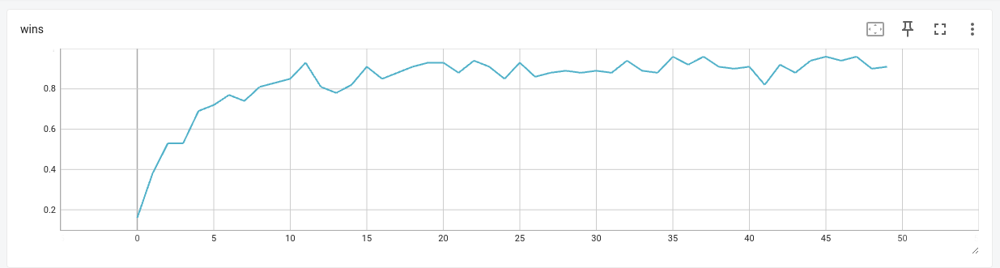

# PROBS - Predict Result of Beam Search

This repository is an implementation of PROBS algorithm:

* Install and play: [Installation](#installation)

* Blog post (featuring story of chess6x6 agent) - https://medium.com/@omikad/train-ai-to-play-chess-6x6-using-probs-algorithm-539e39a9dea6

* Paper: https://arxiv.org/abs/2404.16072 - Playing Board Games with the Predict Results of Beam Search Algorithm

* Live demo: https://www.levinson.ai/games/chess6x6

# Introduction

* This is an algorithm for solving board games: two player, deterministic games with full information. It is similar to AlphaZero, but uses much simpler beam search instead of MCTS. Goal of this work is to show that such simplification also work well and can be trained to get winning agent. I don't have enough computational resources to make a fair comparison with AlphaZero, so if you like to contribute - please email me (email is in paper).

* Two separated networks:

    * Value model: given state `s` predict terminal reward `[-1 ... 1]` if both players play following policy derived from `Q` with added exploration noise

    * Q-Value model: given state `s` for each action `a` predict result of beam search starting from `(s,a)`

* Algorithm is an iterative cycle of the following steps:

    * Execute a predefined number of self-play games. Select moves based on `softmax(Q(s, a))` and Dirichlet noise to boost exploration. Save all games in experience replay

    * Train `V` on each state to predict outcome of the episode for the current player

    * On each observed state start a beam search to generate a limited sub-tree of the game:

        * Root node in beam search game sub-tree is `s0`

        * Always expand `s0` node. Other nodes are expanded in order of their priority

        * When node `s_i` is expanded, its child nodes priorities are `Q(s_i, a_j)`

        * Parameter `M` to control depth limit of the game sub-tree

        * Parameter `E` to control number of expanded nodes

        * Value of a leaf state is `V(s_leaf)`

        * Value of a terminal state is its reward coming from emulator

        * Value of expanded node `s_i` is `max(-child_state_value for every child node)` - every child node value is the value for the next player, so for the player at `s_i` its value is negative. And in order to play optimally player at `s_i` needs to maximize its value.

        * Values of child nodes of root `s0` will be used as a target for `Q(s, a)`

    * Train `Q` using outcome of the beam search as a target for each episode from the experience replay

    * Clear experience replay

# Installation

We used conda environment on Ubuntu 20.04.4 LTS.

1). Install conda https://conda.io/projects/conda/en/latest/user-guide/install/index.html

2). Create environment: `conda create --name probs_env -c conda-forge -c pytorch --file requirements.txt`

3). Activate environment: `conda activate probs_env`

# Usage

## Interactive play

Play game interactively against a specified agent:

`python go_probs.py configs/play_interactively.yaml`

## Play chess6x6 using UI against trained model

`python go_probs.py configs/play_chess.yaml`

Options:

* Human player can play white or black

* AI player:

    * Random - AI plays random moves

    * Two step lookahead - analyzes all potential plans of length 2 to either execute a winning move, if available, avoid immediate losing moves, or otherwise select randomly from the remaining moves

    * AI Model 1 - chess6x6 model trained with PROBS algorithm for 5 days

    * AI Model 2 - chess6x6 model trained with PROBS algorithm for 10 days

* AI params:

    * One-shot - trained AI model `Q(s, a)` is called exactly once for each move, action selected greedily as `argmax(Q(s, *))`

    * Beam search 0.5 sec - AI thinking for 0.5 seconds at each turn. Thinking is implemented as beam search (same as Q value training step in PROBS algorithm)

    * Beam search 1 sec - same, but beam search is limited for 1 second

    * Beam search 3 sec - same, but beam search is limited for 3 second

Note: first AI step is usually much longer because of torch initialization. Also, time constraint is only for beam search part and actual time may be slightly bigger.

## Train Connect Four

`python -u go_probs.py configs/train_connect_four.yaml`

with logging:

`time python -u go_probs.py configs/train_connect_four.yaml 2>&1 | tee __train.log`

takes ~ 4 hours and shows the following learning curve (wins against `two_step_lookahead`):

## Train Chess6x6

`python -u go_probs.py configs/train_chess6x6.yaml`

Training progress:

## Play agent vs agent

Make two AI agents play against each other. Examples:

1). Make a battle between `random` player vs `one_step_lookahead` player, 100 games of connect four:

`python go_probs.py configs/battle_connect_four.yaml`

Output: `RandomAgent vs OneStepLookaheadAgent: wins 0.21000, losses 0.79000. Battle [13, 8, 42, 37, 0], score = 0.21`

Battle array has detailed stats from the player1 point of view: [wins as white, wins as black, losses as white, losses as black, draws]

Score = (wins + 0.5 * draws) / number of games

2). Make a battle between trained model vs two step lookahead player, 1000 games of reversi:

`python go_probs.py configs/battle_reversi.yaml` - TODO

Output: SelfLearningModel1 wins 0.89600, losses 0.10400

## Battle play trained chess agent

1). Trained agent vs random:

`python go_probs.py configs/battle_chess_example1.yaml`

Output: SelfLearningModel66_v11 vs RandomAgent: wins 0.98000, losses 0.00000. Battle [48, 50, 0, 0, 2], score = 0.99

2). Trained agent vs two_step_lookahead (change `player2.kind` attribute in the config to reproduce)

`python go_probs.py configs/battle_chess_example1.yaml`

Output: SelfLearningModel66_v11 vs TwoStepLookaheadAgent: wins 0.98000, losses 0.01000. Battle [49, 49, 1, 0, 1], score = 0.985

3). Trained agent which makes a move using sub-game tree expansion (specified by agent_type=qvalts in the model string argument) vs one-shot trained agent (which calls Q model once per action)

`python go_probs.py configs/battle_chess_example2.yaml`

Output: SelfLearningModel66_v11 vs SelfLearningModel66_v11.with_tree_search: wins 0.00000, losses 1.00000. Battle [0, 0, 50, 50, 0], score = 0.0

We can see that agent amplified with the tree search completely destroys agent without it.

## Config parameters

### Agent definition

Agent configuration defines an agent who will be trained or played with. `kind` attribute defines type of the agent:

* random

* one_step_lookahead - analyzes all potential moves to either execute a winning move, if available,
avoid immediate losing moves, or otherwise select randomly from the remaining moves

* two_step_lookahead - same, but evaluates the game tree up to two moves ahead

* three_step_lookahead - sum, but three moves ahead

* q_player - use model with V and Q models

### Other configuration parameters

* `env.name: mychess6x6` - environment name

* `env.n_max_episode_steps 200` - max number of turns in a game

* `cmd: train` - command is to train model

* `log: tf` - log to tensorboard

* `infra.device: gpu` - use GPU

* `infra.sub_processes_cnt: 10` - split workload to 10 subprocesses

* `infra.self_play_threads: 1` - split workload to 1 thread (more than 1 is not compatible with GPU because of PyTorch)

* `train.n_high_level_iterations: 10000000` - large number of iterations to make training run lasting forever until you stop it (using Ctrl+C)

* `train.v_train_episodes: 6000` - number of self-play games to train V model, usually V iteration is 10x time faster than Q training

* `train.q_train_episodes 3000` - number of self-play games to train Q model (main computational complexity lies here)

* `train.q_dataset_episodes_sub_iter 3` - number of sub-iterations to train Q model, useful if it takes too much RAM

* `train.dataset_drop_ratio: 0.75` - in order to prevent overfitting, drop this number of rows when training

* `train.checkpoints_dir=~/checkpoints` - where to save checkpoints

* `train.train_batch_size: 256` - batch size for train loop

* `train.self_learning_batch_size: 256` - batch size used to get dataset for self play (V model dataset)

* `train.get_q_dataset_batch_size: 256` - batch size used to get dataset for Q model

* `train.num_q_s_a_calls: 50` - number of Q model calls in beam search

* `train.max_depth 100` - max sub-game tree depth in beam search

* `train.alphazero_move_num_sampling_moves: 20` - number of first moves to sample actions, remaning moves will be selected greedily

* `evaluate.evaluate_n_games: 100` - play this number of games to evaluate trained model

* `evaluate.randomize_n_turns: 2` - number of first turns to play randomly (helps to evaluate deterministic players)
